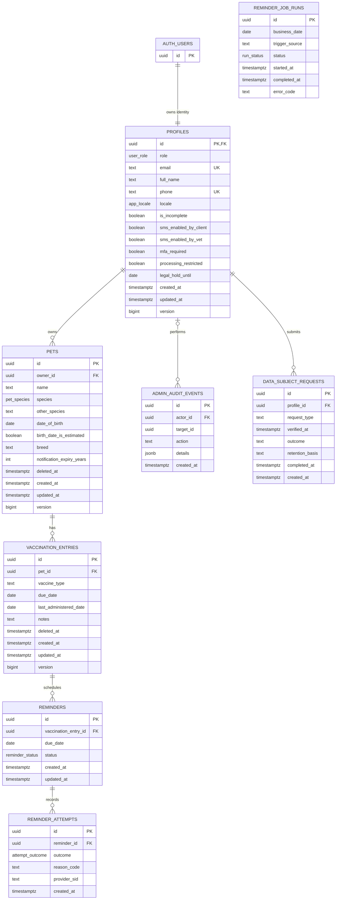

# Database diagram

This diagram represents the schema created by
[`202609100001_initial.sql`](../supabase/migrations/202609100001_initial.sql). `AUTH_USERS`
represents the external `auth.users` table managed by Supabase Auth.

## Enumerations

| Type              | Values                                                                               |
| ----------------- | ------------------------------------------------------------------------------------ |
| `user_role`       | `client`, `vet`                                                                      |
| `app_locale`      | `pt-PT`, `en`                                                                        |
| `pet_species`     | `dog`, `cat`, `other`                                                                |
| `reminder_status` | `pending`, `submitted`, `delivered`, `exhausted`, `cancelled`, `permanently_skipped` |
| `attempt_outcome` | `dry_run`, `submitted`, `transient_failure`, `permanent_skip`                        |
| `run_status`      | `running`, `succeeded`, `failed`                                                     |

## Important constraints

- A profile maps one-to-one to a Supabase Auth user and is deleted when that user is deleted.
- Only one profile can have the `vet` role.
- Profile email addresses are unique case-insensitively; non-null phone numbers are also unique.
- A pet's `other_species` value is required only when its species is `other`.
- Active vaccination entries are unique by pet, normalized vaccine type, and due date.
- A reminder is unique by vaccination entry and due date.
- A submitted reminder attempt must have a provider SID; other outcomes must not have one.
- Only one running or successful reminder job may exist for a business date.
- `ADMIN_AUDIT_EVENTS.target_id` is intentionally not declared as a foreign key in the initial schema.
- All application tables have row-level security enabled. Authenticated access is read-only at the table level; mutations use security-definer functions.
